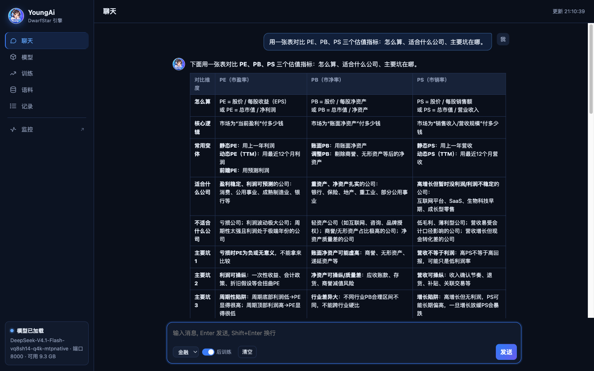

<p align="center">
  
</p>

<h1 align="center">YoungAi</h1>

<p align="center">
  <b>DeepSeek V4.1 Flash — a 510 GB model — on one 128 GB machine.</b><br>
  Chat with it, watch it, and teach it your own data, all from one page.
</p>

<p align="center">
  <b>English</b> · <a href="README.zh-CN.md">中文</a> ·
  <a href="https://github.com/fodelf/YoungAi">GitHub</a> ·
  <a href="https://huggingface.co/wenzhouwu/YoungAi-DeepSeek-V4.1-Flash">Hugging Face</a> ·
  <a href="docs/TECHNICAL.md">Technical notes</a>
</p>



## What you get

- **The whole model on one box.** 113.6 GB, one NVIDIA DGX Spark, a 1M-token context. Nothing goes to a cloud.
- **Fast enough to work with.** 45 tokens/s writing an answer to a real 14k-token agent request; 1,055
  tokens/s reading a 12.5k-token prompt.
- **Close to the original.** A ~40 MB sidecar per domain lifts agreement with the original model by 2.8–3.7
  points in finance, code, law, medicine and science, and general text gets better too, not worse. Switch
  domains mid-chat in under a second, without reloading the model.
- **Teach it your own data.** Upload a file of questions and answers and press *Start training*. On 1,326
  real questions: held-out loss −63% in 72 minutes, general-text check passed. Your data stays on the machine.
- **Open source, plain C.** MIT. C99 + CUDA (Metal for Apple Silicon), one Makefile, no Python in the math.

## Numbers

One DGX Spark, the base plus the sidecar of the domain being measured, scored against DeepSeek's own code
running the original weights at full precision, on text that was never used for fitting.

**Quality**

| Domain | Same top-1: base → with sidecar | Σmin: base → with sidecar |
|---|---:|---:|
| Finance | 71.7% → **74.6%** | 0.703 → **0.745** |
| Code | 78.6% → **82.3%** | 0.754 → **0.803** |
| Law | 72.9% → **76.4%** | 0.713 → **0.760** |
| Medicine | 69.1% → **72.8%** | 0.683 → **0.739** |
| Science | 71.7% → **74.9%** | 0.707 → **0.753** |
| General English (WikiText-2), any one of the five | 78.5% → **80.7–82.8%** | 0.769 → **0.787–0.801** |

*Same top-1* is how often our most likely next token is also the original's. *Σmin* is how much of the two
next-token distributions overlap: 1.0 means identical. Full tables and how they are measured:
[technical notes §5](docs/TECHNICAL.md#5-results).

**Speed**

| | tokens/s |
|---|---:|
| Reading a 12.5k-token prompt | **1,055** |
| Reading a 106.7k-token prompt through the server | 671 |
| Writing, real 14k-token agent request, `temperature` 0 (speculative decoding) | **45.5** |
| Writing, a request never used for tuning, `temperature` 0 | 42.4 |
| Writing, `temperature` 1.0 (the chat default) | 34–37 |

**Footprint**

| | |
|---|---|
| In memory | 113.6 GB model + ~40 MB sidecar, about 1.6 bits per weight |
| On SSD, read as-is | the model's 203 GB n-gram memory tables, ~6 KB per token |
| Context | 1M tokens; a full 1M KV cache is 0.89 GB |

## How to use it

You need a DGX Spark (Linux aarch64 with the CUDA 13 runtime, ~320 GB free SSD, nothing else big running).

**1. Build**

```sh
git clone https://github.com/fodelf/YoungAi.git ~/ds4-main && cd ~/ds4-main
make cuda-spark
```

**2. Open the Studio**

```sh
./ds4-train --host 0.0.0.0 --port 8000
```

Open `http://<host>:8000/` in a browser. No model is loaded yet; the page works anyway.

**3. Download and load the model**

On the *Models* page, press *Download*: about 317 GB, optionally through a mirror. If it breaks, press it
again and it resumes. If you already have shards 47 and 48 of the official checkpoint, enter their folder
and skip 203 GB of it. When it is done, press *Load* under *Local models*. Loading takes about 2 minutes,
and the model must answer a test question before it counts as loaded.

**4. Chat**

Go to *Chat*. The drop-down at the bottom left of the input box switches the domain: finance, code, law,
medicine, science. Switching does not reload the model and takes under a second; if an answer is being
written, the switch waits until it is done. Next to it, a *post-training* checkbox mounts or unmounts the
layer you trained yourself (step 5); it only appears once there is one.

**5. Train on your own data**

Drop a `.jsonl` file on the *Data* page, pick it on the *Train* page and press *Start training*. Training
needs the memory the model is using, so the Studio stops the model, trains, and loads it again; the page
stays connected throughout. The best epoch that passed the general-ability check is picked, written to disk
and tied to the domain sidecar that was loaded while training; the model comes back exactly as it was before
training, nothing is mounted automatically. Back in *Chat*, switch to that domain and turn the *post-training*
switch on to talk to the trained model; turning it off or switching domains unmounts it. A run that fails the
check never shows up in the switch. A smoke run (18 questions, 1 epoch) takes about 6 minutes end to end,
including the check.

Training data is one JSON object per line, in either of the two shapes Unsloth uses:

```json
{"messages":[{"role":"user","content":"What was the entry price?"},{"role":"assistant","content":"30.39"}],"context":"…the source document…"}
{"text":"Raw text, trained as-is (continued pretraining)."}
```

`context` is optional. With it, the model learns to answer as if it had just read the source. Without it,
the model learns the answer itself.

**6. Use it as an API**

The server speaks the OpenAI and Anthropic APIs: `/v1/chat/completions`, `/v1/completions`, `/v1/responses`,
`/v1/messages`.

```sh
curl http://127.0.0.1:8000/v1/chat/completions -H 'Content-Type: application/json' \
  -d '{"messages":[{"role":"user","content":"Explain the price-to-earnings ratio in three sentences."}]}'
```

- Requests without sampling settings use the model card's recipe. Send `"temperature": 0` for output that is
  identical byte for byte on every run.
- Thinking is off by default. Turn it on with `"reasoning_effort": "high"`.
- `/monitor` is a live monitoring page; `/metrics` serves JSON, or Prometheus format with vLLM's metric names.

**API only, no Studio:** one command installs and starts the server, no build needed.

```sh
curl -fsSLO https://huggingface.co/wenzhouwu/YoungAi-DeepSeek-V4.1-Flash/resolve/main/install.sh
bash install.sh                      # --domain code for another domain; --endpoint https://hf-mirror.com for a mirror; --help for all
```

**On a Mac:** `make` builds the Metal version. Every GPU operation has a Metal implementation and 126 kernel
tests pass on a real Apple GPU. The full model has not run on a Mac yet; ours has 16 GB.

## How it works

```
① base        113.6 GB   8-weight vector quantization, one shared codebook per layer, no training data
② sidecar     ~40 MB     per-domain gains and router bias, solved against the original model
③ post-train  ~100 MB    small low-rank layers trained on your own data
```

Each file stacks on the one below without changing it. ① alone is a complete model.

- [Why it is built this way](docs/TECHNICAL.md#2-three-convictions)
- [The algorithms](docs/TECHNICAL.md#4-the-algorithms)
- [What did not work](docs/TECHNICAL.md#6-what-did-not-work)

## Limits

- **Tested end to end on one machine type, the DGX Spark.** Every number on this page comes from it.
- **Sidecars are scored on held-out text, not on end-to-end tasks** such as agentic coding or clinical
  questions.
- **The general-ability check only ships for one text (512 tokens of WikiText-2).** Its reference
  distribution needs the original weights to compute, so it is bundled; other checks need a machine with them.

## Author

Wenzhou Wu (吴文周) · 310066827@qq.com. Questions, reproduction reports and collaboration are welcome; bugs
and pull requests go to [GitHub](https://github.com/fodelf/YoungAi).

## Acknowledgements

YoungAi started as a fork of [antirez/ds4](https://github.com/antirez/ds4) (DwarfStar), Salvatore
Sanfilippo's DeepSeek V4 engine. Like upstream, it owes a lot to
[llama.cpp and GGML](https://github.com/ggml-org/llama.cpp): GGUF, layouts such as q4_K, and much kernel know-how.
The GGML copyright notice stays in `LICENSE`. The model is DeepSeek's. Thanks to DeepSeek for releasing the
weights and the reference code we measure against.

## License

Engine: MIT ([`LICENSE`](LICENSE)). The quantized weights derive from DeepSeek V4.1 Flash, also MIT
([`LICENSE-DeepSeek`](LICENSE-DeepSeek)).
